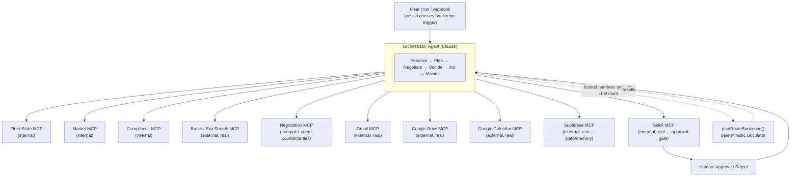

# BunkerNex Autopilot — Agentic AI System Design

**Status: concept / hackathon pitch, not implemented.** This is a design for an agentic layer
that could sit on top of the existing BunkerNex app. It is separate from, and does not describe,
the one real AI call currently in the codebase (the route-plan narrative in
`src/app/api/route-plan/route.ts`, a single-turn Claude Haiku call with no tool use).

## One-liner

Today a human opens the Route Plan desk and clicks "Evaluate route." Autopilot notices a vessel
is *about* to need that evaluation, runs it unprompted — researching prices, checking compliance,
negotiating with suppliers, watching for disruptions — and only asks a human to approve the result.

## Design principle: keep the LLM out of the arithmetic

The agent never computes ROB burn-down, tank capacity, or cost totals itself. Every number still
comes from the existing deterministic `planRouteBunkering()` engine, the same way the current
narrative call treats plan figures as given and final. The agent's job is everything *around* the
math: noticing something needs attention, researching, negotiating, deciding when to re-plan, and
routing the result to a human for approval. This is the difference between "an agent that assists
a procurement process" and "an agent that free-hands numbers in a procurement process" — the
second one doesn't survive contact with a CFO.

## Architecture

## MCP servers

### Internal — wrap the existing BunkerNex data/logic

| Server | Tools | Wraps |
|---|---|---|
| Fleet-State MCP | `list_due_to_bunker`, `get_rob`, `get_eca_exposure` | vessel-tracks simulation |
| Market MCP | `get_forecast`, `get_supplier_offers` | `prices.ts`, `suppliers.ts`, the 3-model forecast ensemble |
| Compliance MCP | `check_grade_eligible`, `compute_carbon_cost` | ECA zones, `NO_HSFO_PORTS`/etc., `co2e_cost_per_mt` |
| Negotiation MCP | `send_rfq`, `counter_offer` | RFQ flow; each "supplier" is a persona-prompted agent with a hidden price floor |

### External — real, already-existing (or already-connected) MCP servers

| Server | Role in the loop | Why it's a strong demo beat |
|---|---|---|
| **Gmail MCP** | Sends the actual RFQ email, reads the reply back for a counter-offer | A real inbox updates live on stage — not a mocked API response |
| **Google Drive MCP** | Reads the Chief Engineer's live availability sheet (`TYPES OF FUEL.xlsx`) at query time | This sheet is *already* the real provenance source per the project's own data notes — the agent reading it live rather than off a stale CSV is a true story, not staged |
| **Google Calendar MCP** | Books a delivery window / supplier call once a plan is approved | Closes the loop into the real world, not just into a chat window |
| **Slack MCP** | Posts the ranked-plan card with one-click Approve/Reject | The human-in-the-loop gate — nothing commits without this |
| **Supabase MCP** | Persists negotiation history and outcomes across runs | Turns the agent from stateless to something that visibly learns ("last time this supplier accepted 2% under ask") |
| **Brave Search / Exa MCP** | Live news/geopolitics query (e.g. "Suez Canal disruption August 2026") | Real, citable results — the trigger for an unprompted mid-voyage re-plan |

### Worth building — no clean existing MCP, but a weekend's work

| Server | Wraps | Payoff |
|---|---|---|
| AIS / live vessel position MCP | MarineTraffic or VesselFinder API | Overlay real ship positions next to the *simulated* fleet — a visible, honest contrast on the map |
| Commodities / FX MCP | EIA or Alpha Vantage | Live Brent + EUR/USD to sanity-check the forecast against a real market tick during the demo |

## The agent loop

**Perceive → Plan → Negotiate → Decide → Act → Monitor**

1. **Perceive** — Fleet-State MCP flags a vessel (e.g. `KOTA PUSAKA`) crossing its bunkering
   trigger within N hours, mid-Mediterranean.
2. **Plan** — Orchestrator fans out Market, Compliance, and Search subagents in parallel.
3. **React to the world** — Search MCP surfaces a live disruption near the planned call port;
   this feeds into re-planning *before* the deterministic engine even runs.
4. **Negotiate** — Negotiation MCP runs 2–3 RFQ rounds against the cheapest suppliers Market MCP
   found, trying to beat their posted offer; Supabase MCP supplies prior negotiation history.
5. **Decide** — Orchestrator calls `planRouteBunkering()` with the negotiated numbers, gets back
   the top-3 ranked plans, and asks Claude to narrate why — same pattern as the app's existing
   narrative call.
6. **Act** — Posts a Slack card (ranked plans, cited sources, Approve/Reject). On approval, drafts
   the RFQ via Gmail MCP and books delivery via Calendar MCP.
7. **Monitor** — Keeps watching; if a new disruption fires mid-voyage, it re-triggers itself and
   posts "your plan changed, here's why" unprompted.

## Demo script (3 minutes)

1. Seed a scenario: vessel 40 hours from its bunkering trigger, sailing toward Rotterdam via the
   Mediterranean.
2. Live trace panel shows subagents firing in parallel — Fleet-State, Market, Compliance, Search.
3. A planted "Red Sea disruption" headline surfaces via Search MCP; watch the plan visibly change
   ports/routes in response, live, not staged.
4. Negotiation MCP shows a real back-and-forth exchange; Gmail MCP sends the actual RFQ.
5. Slack card appears; approve on stage; Calendar MCP books the delivery slot; map updates.
6. Close on: *"Every external server here is either a real, existing MCP connector, or a thin
   wrapper over a public maritime/financial API — the only thing that's simulated is the fleet
   itself, because that's the point of the app. And the agent never touches the arithmetic."*

## Why it scores

- **Real multi-agent + MCP**, not a single wrapped completion — most entries stop at one tool call.
- **Human-in-the-loop before commitment** — answers "what stops the agent from booking $2M of fuel
  by itself" before a judge asks it.
- **Grounded in a real domain** already modelled in this repo (ECA compliance, tank ratios, carbon
  cost) — not hand-waved.
- **A live "shock → replan" moment** is the best demo beat buildable in a weekend: visual,
  dramatic, and proves the agent is reasoning, not replaying a script.

## Appendix: the existing app (3 slides)

Recap of what BunkerNex already does today — the product Autopilot sits on top of, not a
speculative platform. One slide per screen, straight from `USER_MANUAL.md`.

### Slide A — Explorer, the main map ("/")

- Live map of PIL's container-service routes and a 62-vessel simulated fleet, on a dark
  MapLibre basemap
- One time scrubber drives everything on screen — vessel position, fuel levels, bunkering
  events — across a 3-month window in 3-hour steps
- Click a **port** → prices, supplier offers, bunkering history, schedule
- Click a **vessel** → residual/compliance tank levels, "due to bunker" warnings, full
  bunkering history, its service's rotation
- **"Evaluate spot bunkering"** opens a chief-engineer-style requirement form → generates a
  PDF, or jumps straight into Route Plan pre-scoped to that vessel

*Ties to Autopilot:* Perceive is this screen's own "due to bunker" warning — just watched
continuously instead of read off the scrubber by a person.

### Slide B — Supplier HQ ("/hq")

- Pick a **port + fuel grade + forecast horizon** (10 or 30 days)
- Market positioning scatter: price vs. delivery capability
- Supplier scorecards, ranked by year-to-date performance
- Click a supplier for their full bunkering transaction history
- Footer states plainly: quotes, barge fleets, and contract prices here are simulated, not
  sourced

*Ties to Autopilot:* this is the market Market MCP and Negotiation MCP query — the agent
doesn't invent a market, it reads this one.

### Slide C — Route Plan ("/route-plan")

- Pick a **vessel + position**, review the fixed next-port nomination, click "Evaluate route"
- Looks ahead up to 5 calls / 30 days, returns the **top-3 ranked bunkering combinations**
- Cost comparison chart + a plain-language explanation of why the cheapest plan wins — today,
  one single-turn Claude Haiku call over already-final numbers, no tool use
- 3-model price forecast (trend / seasonal / mean-reversion) + ensemble, tank-level timelines
  for the selected plan
- Explicitly labelled as decision support — a greedy cheapest-reachable-call search, not a
  provably optimal solver

*Ties to Autopilot:* this is the exact screen the agent runs unprompted. Today a human clicks
"Evaluate route"; Autopilot notices it should, runs it, negotiates, and only asks for approval.
